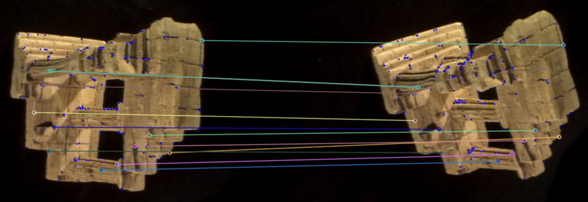

# Structure From Motion From Scratch

Basic SFM implementation "from scratch", using only basic linear algebra support from numpy. Based on the Challenge
Question in section 4.8
in [Introduction to Autonomous Mobile Robots, Second Edition](https://mitpress.mit.edu/books/introduction-autonomous-mobile-robots-second-edition)
.

## Algorithm steps

The implemented algorithm follows the following steps.

Given: two images of the same scene taken from slightly different perspectives.
Then:
1. Detect corners in both images using the Harris corner detector.
1. Match corners using descriptors calculated by Squared Sum of Differences. Use cross-check and ratio-test validation to filter out unlikely matches.
1. Estimate a most likely Essential Matrix from the set of remaining matches. The estimation uses RANSAC with the Eight-Point Algorithm as model fitter and
the Symmetric Epipolar Distance as model scorer.
1. Decompose the Essential Matrix into rotation and translation, extracting a single possible solution using the cheriality check. Filter out matches which fail the cheirality check.
1. Triangulate and visualize the 3D position of remaining matches.

Example illustration of feature matches which were left inliers after running RANSAC:

The small blue markers show the Harris corners. Matching features are connected by colored lines.

## Requirements

* GNU Make 4.1+
* Python 3.10 - install `requirements.txt`

## Sources

Besides the Autonomous Mobile Robots book, I used several other sources to implement the various steps of the vision
pipeline.

### Essential Matrix Estimation and Decomposition

* [Wikipedia](https://en.wikipedia.org/wiki/Eight-point_algorithm#Normalized_algorithm)
* [University of Edinburgh](https://homepages.inf.ed.ac.uk/rbf/CVonline/LOCAL_COPIES/MOHR_TRIGGS/node50.html)
* [Hartley, Richard; Andrew Zisserman (2004). Multiple view geometry in computer vision (2nd ed.). Cambridge, UK.](https://www.robots.ox.ac.uk/~vgg/hzbook/)

### Error Measure for Essential Matrix Selection

* [Mohammed E Fathy; Ashraf Saad Hussein; Mohamed F. Tolba. Fundamental Matrix Estimation: A Study of Error Criteria](https://arxiv.org/abs/1706.07886)
